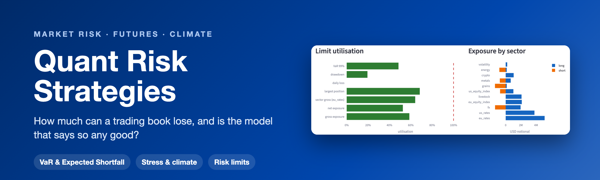
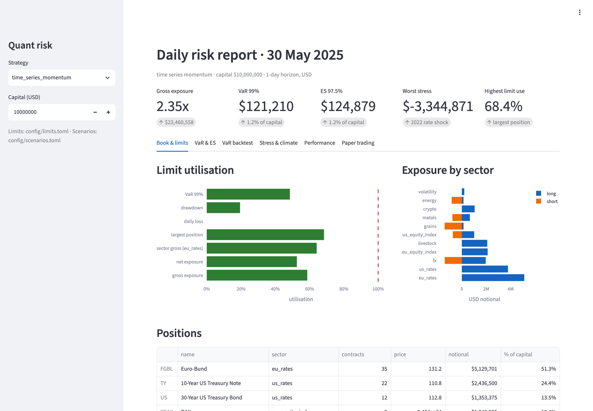
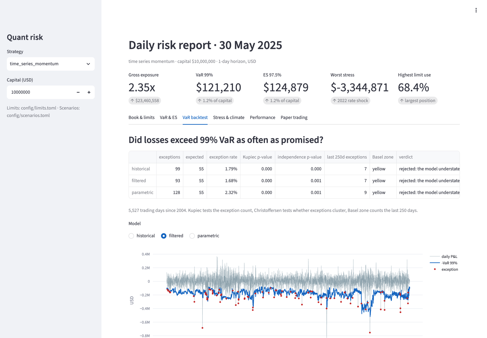
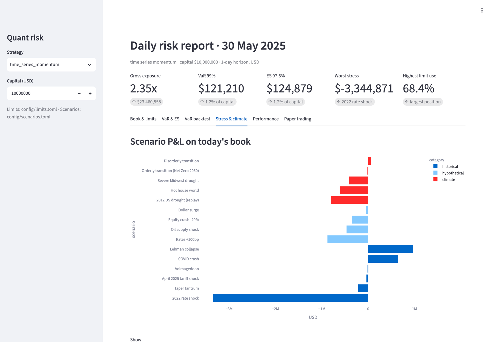
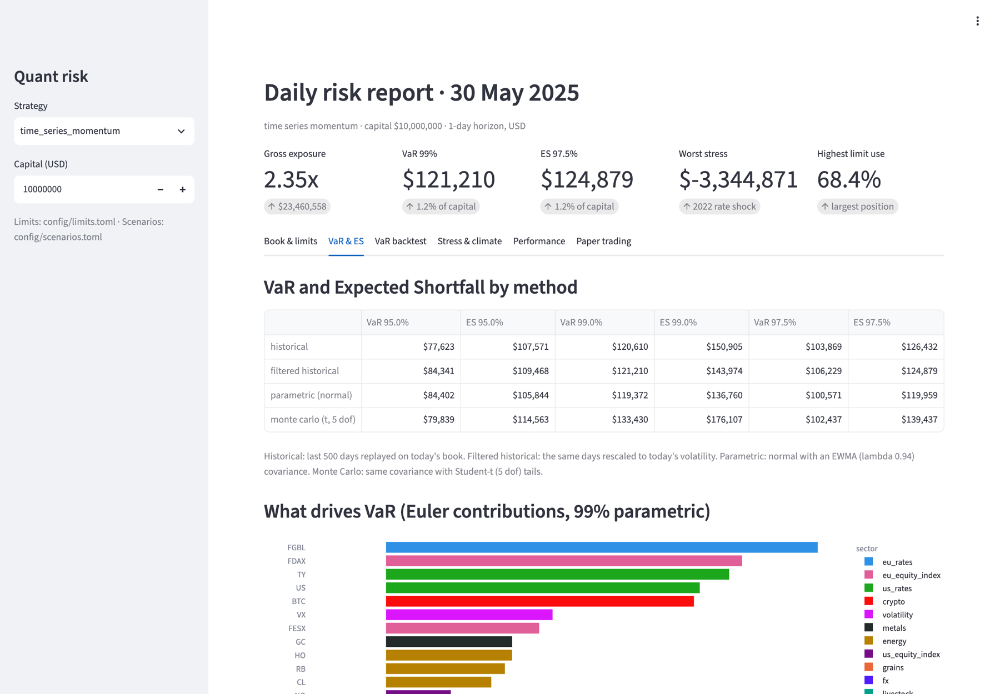
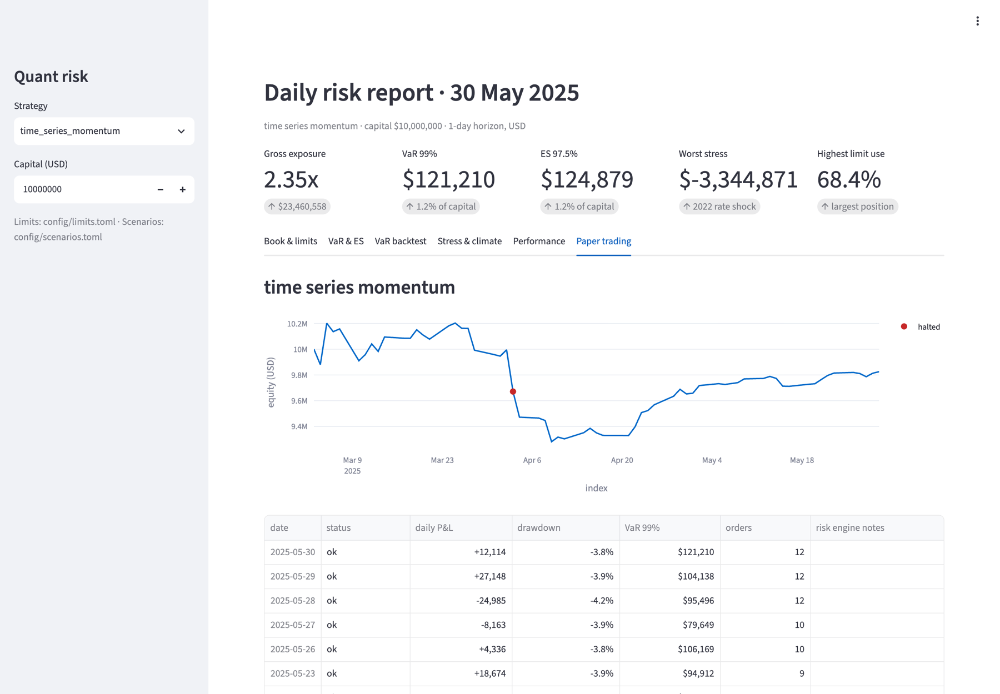
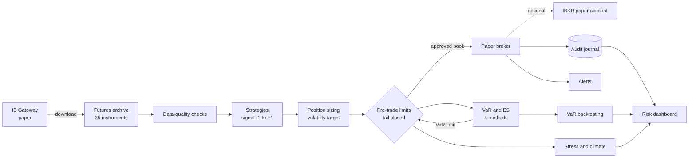

<p align="center"></p>

# Quant Risk Strategies

**A market-risk engine for a systematic futures portfolio.** Volatility-targeted strategies on 35 futures, a fail-closed pre-trade limit framework, VaR and Expected Shortfall four ways, 20 years of VaR backtesting, historical, hypothetical and climate stress tests, a paper-trading loop with an audit journal, and a daily risk dashboard.

> Personal rebuild of the risk layer I worked on in the BSQF IBKR algo-trading project
> (Bocconi Students Quantitative Finance), where I was a Quantitative Risk Management Analyst.

**Claire Giuffra Contri** · MSc Finance, HKUST · [LinkedIn](https://www.linkedin.com/in/claire-g-a0408119b/)




---

## In plain English

Imagine a fund that trades futures (contracts on oil, wheat, government bonds, stock indices) using simple rules. Before anyone asks whether it makes money, a risk team asks three things: *how much could we lose on a bad day, how do we know that estimate is right, and what stops us losing too much?*

This project answers all three on 20 years of real market history. The headline result: the standard industry loss estimates (Value-at-Risk) were **too optimistic for trend-following strategies**, mostly in the crises of 2008 and 2020, when accuracy matters most. A better method that adapts to current volatility cut the worst periods by 63%, and a set of automatic safety limits (a daily loss stop, a drawdown stop-out) stopped the worst losses before they compounded.

---

## Why this project

A trading strategy answers *"what should we hold?"*. A risk function answers the questions that come after it, and this project is built around them:

| Question | Where it is answered |
|---|---|
| How much can we lose on a bad day? | [VaR and Expected Shortfall](#value-at-risk-and-expected-shortfall), four methods |
| Is that estimate any good? | [VaR backtesting](#var-backtesting): Kupiec, Christoffersen, Basel traffic light |
| What happens in a crisis? | [Stress testing](#stress-testing-and-climate-scenarios): 2008, 2020, 2022, April 2025 |
| What if the energy transition is disorderly, or the Midwest has a drought? | [Climate scenarios](#stress-testing-and-climate-scenarios), NGFS-style |
| Are we within mandate? | [Pre-trade limits](#risk-limits), checked before every order |
| Which positions drive the risk? | [Euler risk contributions](#value-at-risk-and-expected-shortfall) |

The strategies are deliberately simple. The point of the project is the risk layer around them.

---

## Key findings

**1. Every VaR model failed its backtest on the trend strategies, and the failure is informative.**
Over 5,527 trading days (2004–2025) a 99% VaR should be breached about 55 times. A normal (parametric) VaR was breached 128 times (2.3%), plain historical VaR 99 times, and the exceptions cluster in 2008 and 2020, exactly when a VaR number matters most. **Filtered historical simulation**, which rescales history to today's volatility, cut the days spent in the Basel red zone by 63% (462 → 172), and on a buy-and-hold book it passes cleanly (1.01% exceptions, Kupiec p = 0.92, no red-zone days). What remains for trend strategies is *momentum crash risk*: they are positioned in the direction of recent moves, so a sharp reversal hurts more than unconditional history suggests.

**2. The current book's largest risk is a rates concentration, not equities.**
On 30 May 2025 the momentum book is long Bund and US Treasury futures. The Bund alone is the largest contributor to VaR (14%), and replaying the **2022 rate shock costs 33% of capital**, far more than any equity scenario; a +100bp parallel shock costs 8.8%. In a risk committee, this concentration would be the headline.

**3. Climate scenarios find exposures that VaR does not.**
A replay of the **2012 US drought costs 8.0% of capital** through short corn and soybean positions, and a *hot-house world* scenario 6.1%. A disorderly transition is roughly flat (+0.6%) because the book happens to be short energy. For this book, physical climate risk matters more than transition risk.

**4. The limit framework changes outcomes.**
Replaying the paper-trading loop through spring 2025, the daily-loss stop fired on 3 April (−$324k against a $300k limit) and the VaR limit scaled the book down through the tariff week; the drawdown bottomed at −9.2% and recovered to −3.8%. Over the full history, the 25% drawdown stop-out limits time-series momentum's worst drawdown to −26% instead of −37%, and stops the mean-reversion strategy in January 2008, before an 85% loss.

---

## Screenshots

| | |
|---|---|
| **VaR backtest**: exceptions against the 99% VaR line  | **Stress and climate scenarios** on today's book  |
| **VaR and ES** by method, and which positions drive it  | **Paper trading** through the April 2025 tariff shock; the red dot is the daily-loss stop  |

Run it yourself with `streamlit run app/dashboard.py` (six tabs: book and limits, VaR and ES, VaR backtest, stress and climate, performance, paper trading).

---

## How it works



| Module | What it does |
|---|---|
| [`instruments`](src/quant_risk/instruments.py) | Contract specs for 35 futures (multiplier, currency, sector). Every dollar figure goes through the multiplier |
| [`bars`](src/quant_risk/bars.py), [`quality`](src/quant_risk/quality.py) | Daily bar storage; data-quality checks for impossible bars, gaps, stale prices, extreme moves |
| [`fx`](src/quant_risk/fx.py) | Converts euro P&L (DAX, Euro Stoxx 50, Bund) to USD at daily rates |
| [`strategies`](src/quant_risk/strategies.py) | Time-series momentum, multi-horizon trend, MA crossover, mean reversion, buy and hold |
| [`sizing`](src/quant_risk/sizing.py) | Volatility targeting, sector risk budgets, diversification multiplier, ex-ante risk overlay |
| [`backtest`](src/quant_risk/backtest.py), [`metrics`](src/quant_risk/metrics.py) | Daily USD backtest with costs; Sharpe, Sortino, drawdown, Calmar, skew |
| [`limits`](src/quant_risk/limits.py) | Pre-trade risk engine with hard and soft limits, utilisation, and a historical replay |
| [`var`](src/quant_risk/var.py) | VaR and ES (historical, filtered historical, parametric, Monte Carlo) and Euler contributions |
| [`var_backtest`](src/quant_risk/var_backtest.py) | Kupiec proportion-of-failures, Christoffersen independence, Basel traffic light |
| [`stress`](src/quant_risk/stress.py) | Scenario engine, reverse stress test, sector shock grid |
| [`cycle`](src/quant_risk/cycle.py), [`paper`](src/quant_risk/paper.py), [`alerts`](src/quant_risk/alerts.py) | Daily trading cycle, simulated broker, SQLite audit journal, Telegram alerts |
| [`ibkr`](src/quant_risk/ibkr/) | Interactive Brokers connection (optional): downloads futures and EUR/USD from IB Gateway, qualifies every contract before use, and routes orders to a paper account |
| [`report`](src/quant_risk/report.py), [`dashboard`](app/dashboard.py) | Daily risk report and the Streamlit dashboard |

---

## Methods

### Position sizing

One crude oil contract moves around $1,500 a day and one 10-year note around $400, so holding "one of each" would leave the book dominated by oil. Positions are sized by **risk, not count**: capital × a 15% annual volatility target becomes a daily dollar risk budget, shared equally between sectors and then between the instruments in each, and divided by each contract's dollar volatility.

A **diversification multiplier**, 1/√(w′Cw) from correlations known at the time, accounts for instruments partly offsetting each other. It is deliberately conservative (negative correlations count as zero, capped at 2.5), so the book runs below its target rather than above it. An **ex-ante overlay** computes the portfolio's predicted volatility √(x′Σx) from an EWMA covariance matrix every day and cuts every position if it is too high; it never raises them.

### Risk limits

All limits live in [`config/limits.toml`](config/limits.toml) and **every one must be set**. A missing value stops trading instead of meaning "unlimited", and if the day's P&L cannot be measured, nothing that adds risk is approved.

| Type | Limit ($10m book) | When hit |
|---|---|---|
| Hard | Kill switch | No orders at all |
| Hard | Daily loss, $300k | Reduce-only for the rest of the day |
| Hard | Drawdown, 25% | Close every position and stay flat |
| Soft | Gross and net exposure, sector gross, position size, order size | Shrink the book until it fits |
| Soft | 1-day 99% VaR, $250k | Scale the book down, then review it again |

Every review reports each limit's **utilisation**, so an approaching breach shows as a number nearing 100%, not just a yes or no.

### Value-at-Risk and Expected Shortfall

**99% VaR** is the loss exceeded on one day in a hundred. **Expected Shortfall** is the average loss on those days, which is why Basel's FRTB replaced 99% VaR with 97.5% ES. A futures position's P&L is linear in the price change, so every method works directly on dollar P&L per contract, with no pricing model:

| Method | Idea | Strength | Weakness |
|---|---|---|---|
| Historical | Replay the last 500 days on today's book | No distribution assumed | Blind to anything outside the window |
| Filtered historical | The same days, rescaled to today's volatility | Real fat tails *and* current volatility | Depends on a volatility model |
| Parametric | Normal distribution, EWMA covariance (RiskMetrics, λ = 0.94) | Fast, reacts quickly | Normal tails are too thin |
| Monte Carlo | Correlated Student-t draws (5 degrees of freedom) | Fat tails by construction | The tail shape is an assumption |

**Euler risk contributions** split VaR across positions so that the parts add up exactly to the total; a negative contribution is a hedge.

| Book on 30 May 2025 | VaR 95% | VaR 99% | ES 97.5% |
|---|---|---|---|
| Historical | $77,623 | $120,610 | $126,432 |
| Filtered historical | $84,341 | $121,210 | $124,879 |
| Parametric (normal) | $84,402 | $119,372 | $119,959 |
| Monte Carlo (t, 5 dof) | $79,839 | $133,430 | $139,437 |

### VaR backtesting

Each day's VaR, computed only from data up to that close, is compared with the next day's P&L on the positions held. **Kupiec's** test checks the number of exceptions, **Christoffersen's** whether they cluster, and the **Basel traffic light** counts 99% exceptions over the last 250 days (green 0–4, yellow 5–9, red 10 or more).

| Time-series momentum, 99% VaR, 2004–2025 | Exceptions (55 expected) | Rate | Days in red zone |
|---|---|---|---|
| Historical | 99 | 1.79% | 462 |
| Filtered historical | 93 | 1.68% | 172 |
| Parametric | 128 | 2.32% | 272 |

### Stress testing and climate scenarios

Scenarios live in [`config/scenarios.toml`](config/scenarios.toml), each with its reasoning, so they can be reviewed and changed without touching code.

- **Historical replays** apply each instrument's actual price change between two dates to today's book: Lehman (Sep–Oct 2008), the COVID crash (Feb–Mar 2020), the 2022 rate shock, the April 2025 tariff shock, Volmageddon (2018) and the taper tantrum (2013).
- **Hypothetical shocks**: equity crash −20%, rates +100bp (duration-based), oil supply shock, dollar surge.
- **Climate scenarios** following the NGFS narratives:
  - *Transition risk*: a **disorderly transition** (a sudden carbon price: oil −25%, copper and platinum up on electrification and hydrogen demand, soybean oil up as a biofuel feedstock) and an **orderly Net Zero 2050** path.
  - *Physical risk*: a **severe Midwest drought** (corn +35%, feeder cattle down as feed costs rise), a chronic **hot-house world**, and a **replay of the actual 2012 US drought**.
- **Reverse stress testing** searches the whole history for the worst 1, 5 and 20-day windows for today's book, with no scenario chosen in advance.

### Strategy performance

2003–2025, $10m, 15% volatility target, after costs, before limits:

| Strategy | Return | Volatility | Sharpe | Max drawdown | Skew |
|---|---|---|---|---|---|
| Buy and hold | 7.2% | 10.5% | 0.68 | −33.6% | −0.06 |
| Time-series momentum | 4.8% | 12.1% | 0.39 | −37.2% | −1.10 |
| Multi-horizon trend | 2.7% | 5.8% | 0.47 | −11.5% | −0.65 |
| MA crossover | 5.0% | 12.3% | 0.41 | −23.7% | −0.76 |
| Mean reversion | −3.3% | 8.6% | −0.39 | −90.0% | −1.44 |

Every strategy has negative skew: occasional sharp losses, which is the reason for a risk layer on top.

---

## Quick start

Requires Python 3.11+. To explore the code without any market data, run the tests (they use simulated markets); to see the dashboard on real numbers you need your own futures data (see below).

```bash
python -m venv .venv && source .venv/bin/activate
pip install -e ".[dev,dashboard]"

# 1. Get market data (not included): from IB Gateway, or from an archive you already have
python scripts/download_ibkr.py --dry-run          # see "Connect to Interactive Brokers" below
python scripts/import_archive.py /path/to/archive/daily --fx-hourly /path/to/EURUSD.parquet

# 2. Compare the strategies and print today's risk report
python scripts/run_backtest.py
python scripts/risk_report.py

# 3. Replay paper trading through a period, then open the dashboard
python scripts/paper_cycle.py --replay 2025-03-03 2025-05-30 --reset --quiet
streamlit run app/dashboard.py

# Tests run on synthetic markets, so no market data is needed
pytest
```

```
src/quant_risk/   library: data, strategies, sizing, limits, VaR, stress, trading cycle, report
app/              Streamlit risk dashboard
scripts/          data import and IBKR download, backtest, risk report, paper-trading cycle
config/           limits.toml (risk limits), scenarios.toml (stress and climate scenarios)
tests/            186 tests on synthetic data and a scripted fake gateway
data/, var/       market data and paper-trading journal, local only (git-ignored)
```

### Connect to Interactive Brokers (optional)

Everything above runs without a broker. To download the data yourself instead of importing an archive:

1. Install IB Gateway (or Trader Workstation) and log in to a **paper** account.
2. In its settings enable the API socket. Paper ports are `4002` (Gateway) and `7497` (TWS). Live ports `4001` and `7496` are refused by the code, so a typo cannot reach a real account.
3. `pip install -e ".[ibkr]"`, then `cp .env.example .env` and set `IBKR_PORT` (and `IBKR_ACCOUNT=DU...` to send orders). No password is stored anywhere: the login lives in Gateway.
4. `python scripts/download_ibkr.py --dry-run --symbols ES TY JY` lists the contract months IBKR returns for each instrument and stops if anything does not match `instruments.csv`.
5. `python scripts/download_ibkr.py` downloads everything (add `--fx` for EUR/USD). A first full download takes hours because IBKR allows about 55 history requests per 10 minutes; later runs fetch only the newest contracts and are checked against what is already on disk before anything is written.
6. `python scripts/paper_cycle.py --broker ibkr` sends the approved orders to the paper account, after the same pre-trade limits as the simulated broker.

---

## Data and limitations

- **Market data is not included.** Exchange data is licensed to whoever downloads it. The project reads daily back-adjusted continuous futures plus spot EUR/USD, from an archive you import or from your own IB Gateway; see [`data/README.md`](data/README.md). The reported results use an archive that ends in May 2025.
- **Back-adjusted prices.** Older prices are shifted to remove contract-roll gaps, which can push them below zero. All risk is therefore measured on dollar P&L (price change × multiplier), never on percentage returns. Historical *notional* exposure is only approximate for the same reason, so exposure limits are enforced on today's book, where prices are exact.
- **Stress tests use today's book unchanged.** A multi-month replay such as 2022 overstates the loss of a strategy that would have traded through it.
- **Climate shocks are illustrative.** Directions and sizes follow the NGFS narratives and the 2012 drought, but they are not calibrated model output.
- **Costs** are a flat $3 per contract; roll costs are not charged.
- **The IBKR code is tested against a scripted fake gateway, not yet against a live paper session.** Symbols and multipliers in [`futures_map.csv`](src/quant_risk/ibkr/futures_map.csv) are checked against IBKR on every run and any mismatch stops that instrument, but run `--dry-run` once on your own Gateway first.
- An educational project, not investment advice. Live trading is not supported: only paper ports are accepted.

---

## About

I'm **Claire Giuffra Contri**, an MSc Finance student at HKUST (Financial Analysis and Investment Management), on a risk-management exchange at Bocconi, focusing on market and climate risk. Before this I worked on sustainable investment and risk at SCOR, and on green-finance policy at the European Chamber of Commerce in Hong Kong.

This repository is my own rebuild of the risk layer of the **BSQF "Python-integrated IBKR Account for Algo Trading"** project, where I was a Quantitative Risk Management Analyst. The time-series momentum and multi-horizon trend strategies are my contributions to that project, rebuilt here for futures: long and short, and measured on price differences. The IBKR connection code (client, contract qualification, backward history walk) is adapted from that project, used with its authors' permission. Thanks to the BSQF project team.

[LinkedIn](https://www.linkedin.com/in/claire-g-a0408119b/) · [GitHub](https://github.com/Claerys)
